## Final Lab Task 6 - MongoDB Practice

Part 1. MongoDB Exercise in mongo shell

## create database
Connect to a running mongo instance, use a database named `mongo_practice`.
## Insert Documents
Insert the following documents into a `movies` collection.
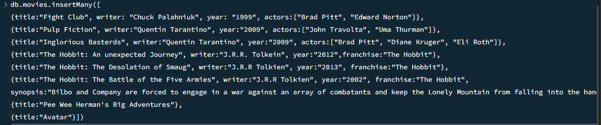
## Query / Find Documents

query the `movies` collection to

1. get all documents
```
db.movies.find()
```
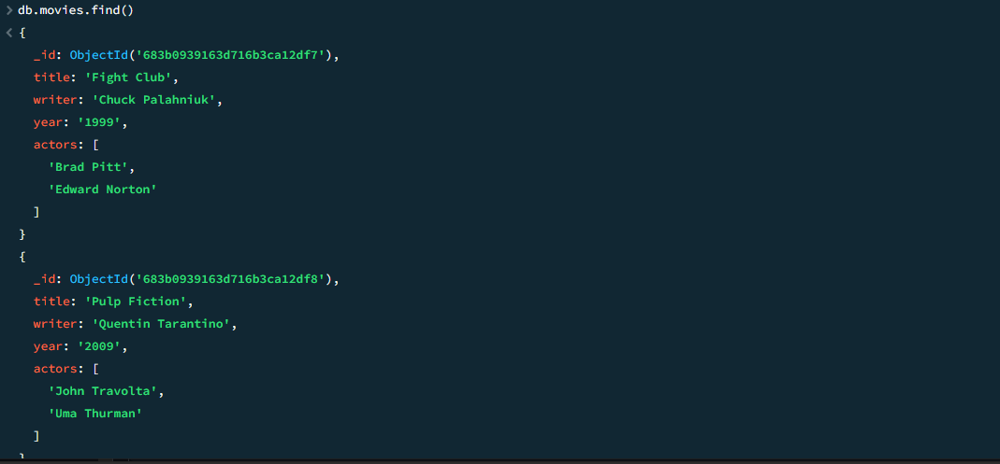

2. get all documents with `writer` set to "Quentin Tarantino"
```
db.movies.find({writer:"Quentin Tarantino"})
```
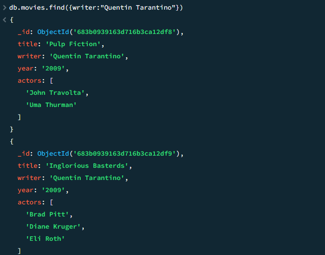

3. get all documents where `actors` include "Brad Pitt"
```
db.movies.find({actors:"Brad Pitt"})
```
 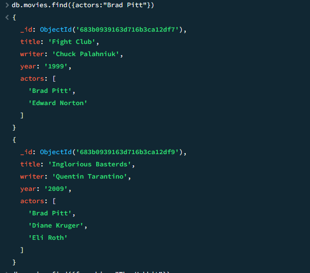
 
4. get all documents with `franchise` set to "The Hobbit"
```
db.movies.find({franchise:"The Hobbit"})
```
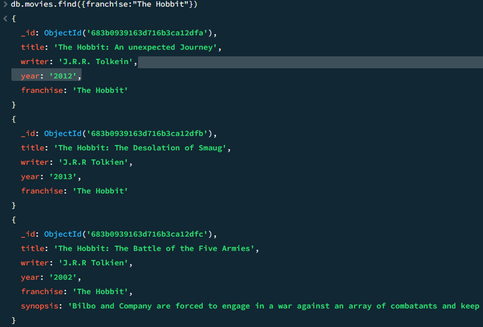

5. get all movies released in the 90s
```
db.movies.find({year:{$gt:"1990", $lt:"2000"}})
```
6. get all movies released before the year 2000 or after 2010
```
db.movies.find({$or:[{year:{$gt:"2010"}},{year: {$lt:"2000"}}]})
```
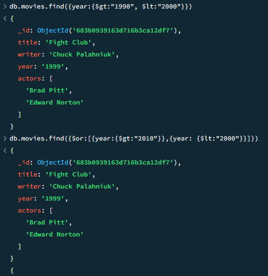

## Update Documents

<ins> 1. add a synopsis to "The Hobbit: An Unexpected Journey" : "A reluctant hobbit, Bilbo Baggins, sets out to the Lonely Mountain with a spirited group of dwarves to reclaim their mountain home - and the gold within it - from the dragon Smaug."
> db.movies.update({_id:ObjectId("683b0939163d716b3ca12dfa")}, {$set:{synopsis:"A reluctant hobbit, Bilbo Baggins, sets out to the Lonely Mountain with a spirited group of dwarves to reclaim their mountain home - and the gold within it - from the dragon Smaug."}})
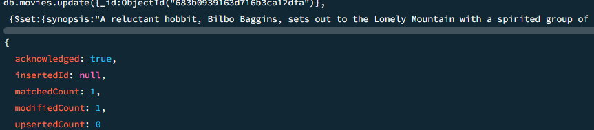

<ins> 2. add a synopsis to "The Hobbit: The Desolation of Smaug" : "The dwarves, along with Bilbo Baggins and Gandalf the Grey, continue their quest to reclaim Erebor, their homeland, from Smaug. Bilbo Baggins is in possession of a mysterious and magical ring."
> db.movies.update({_id:ObjectId("683b0939163d716b3ca12dfb")}, {$set:{synopsis:"The dwarves, along with Bilbo Baggins and Gandalf the Grey, continue their quest to reclaim Erebor, their homeland, from Smaug. Bilbo Baggins is in possession of a mysterious and magical ring."}})
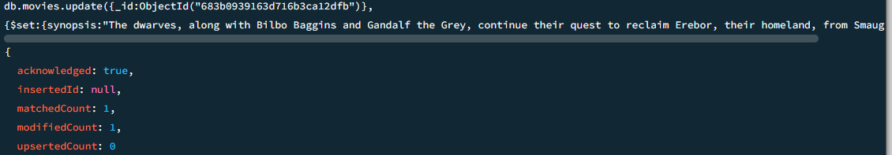

<ins> 3. add an actor named "Samuel L. Jackson" to the movie "Pulp Fiction"
> db.movies.update({_id:ObjectId("683b0939163d716b3ca12df8")}, {$push:{actors:"Samuel L. Jackson"}})  


## Text Search

1. find all movies that have a synopsis that contains the word "Bilbo"
> db.movies.find({synopsis:{$regex:"Bilbo"}})/
2. find all movies that have a synopsis that contains the word "Gandalf"
> db.movies.find({synopsis:{$regex:"Gandalf"}})
3. find all movies that have a synopsis that contains the word "Bilbo" and not the word "Gandalf"
> db.movies.find({$and:[{synopsis:{$regex:"Bilbo"}}, {synopsis:{$not:/Gandalf/}}]})
4. find all movies that have a synopsis that contains the word "dwarves" or "hobbit"
> db.movies.find({$or:[{synopsis:{$regex:"dwarves"}}, {synopsis:{$regex:"hobbit"}}]})
5. find all movies that have a synopsis that contains the word "gold" and "dragon"
> db.movies.find({$and:[{synopsis:{$regex:"gold"}}, {synopsis:{$regex:"dragon"}}]})

## Delete Documents

<ins> 1. delete the movie "Pee Wee Herman's Big Adventure"
> db.movies.remove({_id:ObjectId("683b0939163d716b3ca12dfd")})
<ins> 2. delete the movie "Avatar"
> db.movies.remove({_id:ObjectId("683b0939163d716b3ca12dfe")})
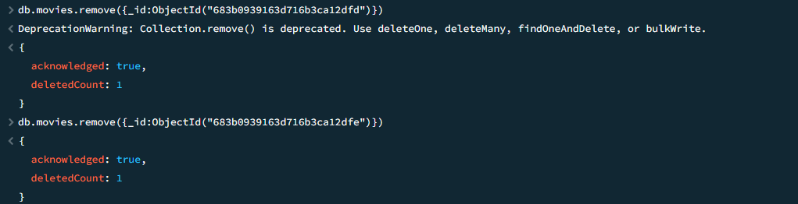

## Relationships

### Insert the following documents into a `users` collection

<ins> username : GoodGuyGreg
first_name : "Good Guy"
last_name : "Greg"
> db.users.insert({_id:1,username:"GoodGuyGreg", first_name:"Good Guy", last_name:"Greg"})

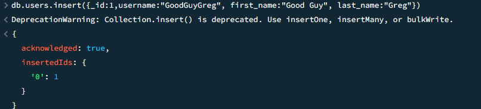

<ins> username : ScumbagSteve
full_name :
  first : "Scumbag"
  last : "Steve"
> db.users.insert({_id:2, username:"ScumbagSteve", fullname:{first: "Scumbag", last:"Steve"}})

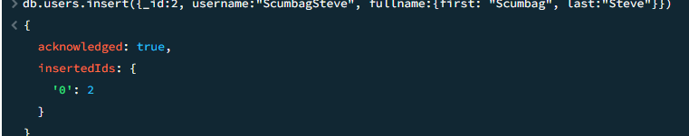

### Insert the following documents into a `posts` collection

<ins> username : GoodGuyGreg
title : Passes out at party
body : Wakes up early and cleans house
> db.posts.insert({username:"GoodGuyGreg", title:"Passes out at Party", body:"Raises your credit score"})

<ins> username : GoodGuyGreg
title : Steals your identity
body : Raises your credit score
> db.posts.insert({ username:"GoodGuyGreg", title:"Steals your identity", body:"Raises your credit score"})> 

<ins> username : GoodGuyGreg
title : Reports a bug in your code
body : Sends you a Pull Request
> db.posts.insert({username:"GoodGuyGreg", title:"Reports a bug in your code", body:"Sends you a pull request"})

<ins> username : ScumbagSteve
title : Borrows something
body : Sells it
> db.posts.insert({ username:"ScumbagSteve", title:"Borrows something", body:"Sells it"})

<ins> username : ScumbagSteve
title : Borrows everything
body : The end
> db.posts.insert({ username:"ScumbagSteve", title:"Borrows everything", body:"The end"})

<ins> username : ScumbagSteve
title : Forks your repo on github
body : Sets to private
> db.posts.insert({username:"ScumbagSteve", title:"Forks your repo on github", body:"Sets to private"})


### Insert the following documents into a `comments` collection

<ins> username : GoodGuyGreg
comment : Hope you got a good deal!
post : [post_obj_id]
> where [post_obj_id] is the ObjectId of the `posts` document: "Borrows something"
> db.comments.insert({ username:"GoodGuyGreg", comment:"Hope you got a good deal!", post:ObjectId("5ca0b7e96435f98b5901f463")})

<ins> username : GoodGuyGreg
comment : What's mine is yours!
post : [post_obj_id]
> where [post_obj_id] is the ObjectId of the `posts` document: "Borrows everything"
> db.comments.insert({username:"GoodGuyGreg", comment:"What's mine is yours!", post:ObjectId("5ca0b9706435f98b5901f46a")})

<ins> username : GoodGuyGreg
comment : Don't violate the licensing agreement!
post : [post_obj_id]
> where [post_obj_id] is the ObjectId of the `posts` document: "Forks your repo on github
> db.comments.insert({username:"GoodGuyGreg", comment:"Don't violate the licensing agreement!", post:ObjectId("5ca0b8766435f98b5901f467")})

<ins> username : ScumbagSteve
comment : It still isn't clean
post : [post_obj_id]
> where [post_obj_id] is the ObjectId of the `posts` document: "Passes out at party"
> db.comments.insert({username:"ScumbagSteve", comment:"It still isn't clean", post:ObjectId("5ca0b8546435f98b5901f466")})

<ins> username : ScumbagSteve
comment : Denied your PR cause I found a hack
post : [post_obj_id]
> where [post_obj_id] is the ObjectId of the `posts` document: "Reports a bug in your code
> db.comments.insert({username:"ScumbagSteve", comment:"Denied your PR cause I found a hack", post:ObjectId("5ca0b9256435f98b5901f469")})
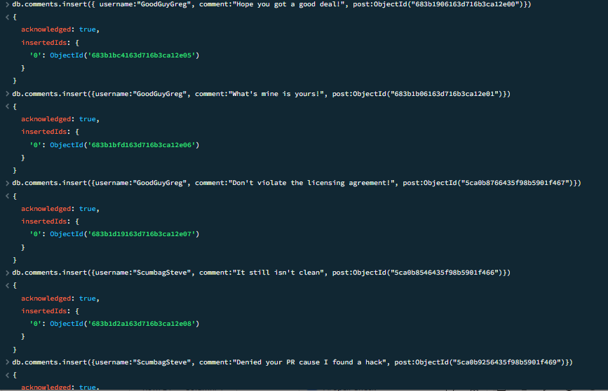

## Querying related collections

<ins> 1. find all users

> db.users.find().pretty()

<ins> 2. find all posts

> db.posts.find().pretty()


<ins> 3. find all posts that was authored by "GoodGuyGreg"

> db.posts.find({username:"GoodGuyGreg"})

<ins> 4. find all posts that was authored by "ScumbagSteve"

> db.posts.find({username:"ScumbagSteve"})


<ins> 5. find all comments

> db.comments.find().pretty()

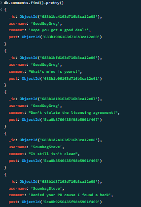

<ins> 6. find all comments that was authored by "GoodGuyGreg"

> db.comments.find({username:"GoodGuyGreg"})

<ins> 7. find all comments that was authored by "ScumbagSteve"

> db.comments.find({username:"ScumbagSteve"})


<ins> 8. find all comments belonging to the post "Reports a bug in your code"
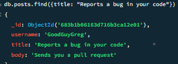


Post your answers in your GitHub portfolio ff: the format below: i.e


