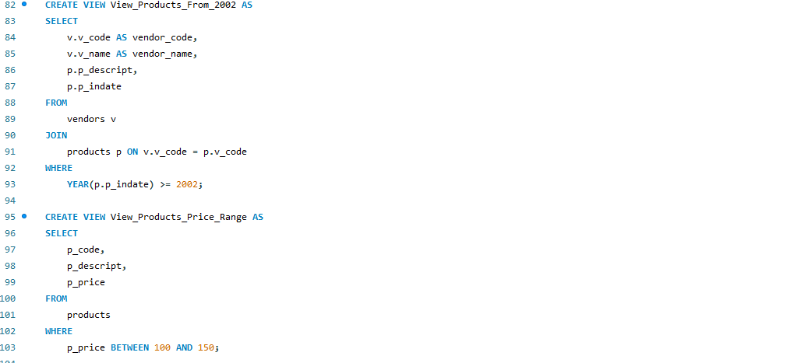
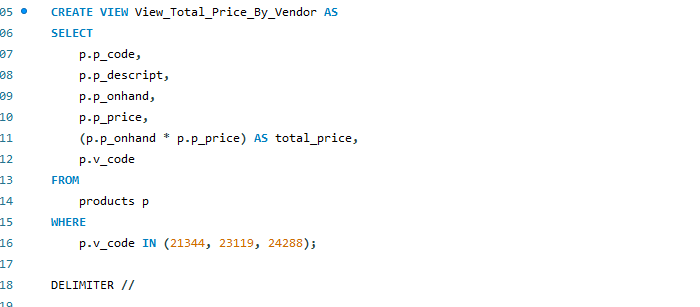
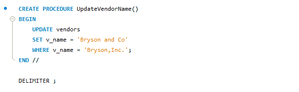
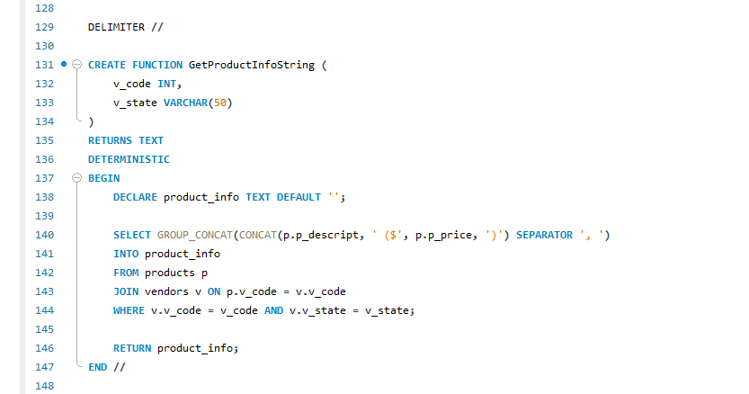

## Final Term Lab Task 5 - Using SQL views and Stored Procedures and Stored Functions

1. To have an idea of how SQL views work, kindly read the lecture on SQL views and stored procedures, then you may try the following examples in MySQL Workbench: 
2. Start Xampp and MySQL Workbench – create or start a connection 
4. Open the democodes.sql, and you may try executing all the examples using the hrd.sql file

5. AFTER the practice codes…. Perform the required SQL statements of the ff: use inventory.sql for this. 
> [FianlLabTask5](inventoiry.sql)

6. Print screen the appropriate sql and output per item

* 1 <ins>CREATE A VIEW that will display the vendors_code, vendors name, product description p_indate, of all products with p_indate from 2002 onwards
* 2 <ins>CREATE a VIEW that will display all createfunctiongetproduct.pngproducts whose price range is between 100-150
> 

* 3 <ins>Create a VIEW that will COMPUTE for the (TOTAL_PRICE) of ALL PRODUCTS by getting the (P_ONHAND x P_PRICE) Sold by vendors with the following v_code (21344, 23119 and 24288) 
>

* 4 <ins>CREATE a STORED PROCEDURE that WILL take a SINGLE PARAMETER and UPDATED the Name of Vendor ‘Bryson,Inc.’ to ‘Bryson and Co’.
> 

* 5 <ins>CREATE A Function that will take 2 parameters(v_code and v_state) and display All the product description and price based on the parameters passed to the function
> 

