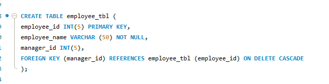
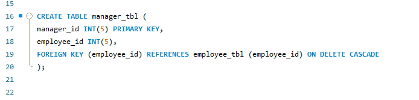
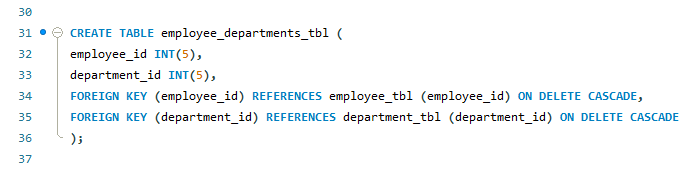
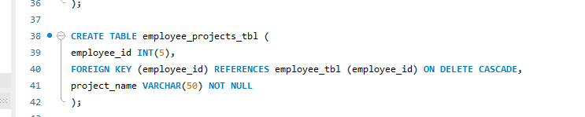
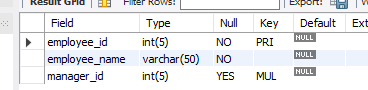
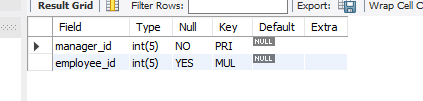
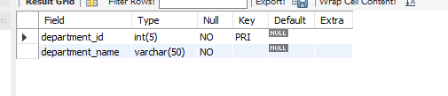
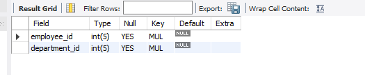
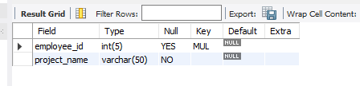
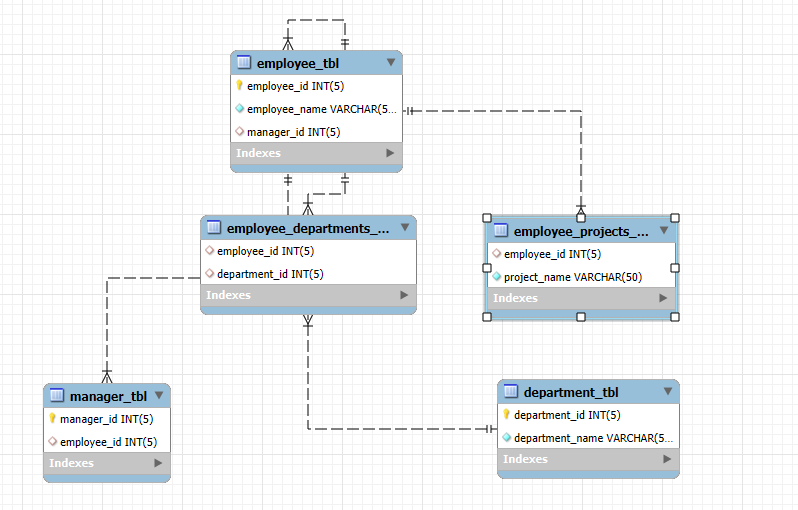

## Final Term Lab Task 1- Multi Level Company Database
* The following are the tasks that need to be implemented using MySQL statements. Make sure to
complete them in the order specified

# Task 1
* <ins>Create a table named employees with the following fields:
>  employee_id: Unique integer, auto-increment, primary key.\
employee_name: String (VARCHAR) with up to 255 characters, not null.\
manager_id: Integer, foreign key referencing employee_id in the same table (employees).

# Task 2
* <ins>Create a table named departments with the following fields:
>  department_id: Unique integer, auto-increment, primary key.\
department_name: String (VARCHAR) with up to 255 characters, not null.

# Task 3
* <ins>Create a table named employee_departments with the following fields:
>  employee_id: Integer, foreign key referencing employee_id in employees.\
department_id: Integer, foreign key referencing department_id in departments.
Composite primary key (employee_id, department_id).

# Task 4
* <ins>Create a table named employee_projects with the following fields:
>  employee_id: Integer, foreign key referencing employee_id in employees.\
project_name: String (VARCHAR) with up to 255 characters, not null.

# Task 5
* <ins>Create a table named managers with the following fields:
>  manager_id: Unique integer, auto-increment, primary key.\
employee_id: Integer, foreign key referencing employee_id in employees.

## Task 1 Table

## Task 2 Table

## Task 3 Table

## Task 4 Table

## Task 5 Table

## ER Diagram

