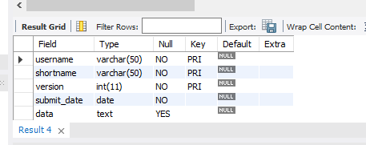

## Final Lab Task 2 - Transform ER into Relational tables
Given the ER diagram representing student assignment submissions, convert it into MySQL
tables. Capture all entities and their attributes, and define the relationships between students,
submissions, and assignments. Identify the primary and foreign keys and ensure proper
representation of any dependent or weak entities.

# In converting the ER diagram,
 _The following are the data types of the attributes:_

 
* **student table and code:**
> username: String (VARCHAR), up to 50 characters.
> 
> 

* **assignment table and code:**
> shortname: String (VARCHAR), up to 50 characters.\
due_date: Date, cannot be null.\
url: String (VARCHAR), up to 255 characters, can be null.
> 
 
> 
* **submission table and code:**
> username: String (VARCHAR), up to 50 characters.\
shortname: String (VARCHAR), up to 50 characters.\
version: Integer, represents the version of the submission.\
submit_date: Date, cannot be null.\
data: Text.

# *EER*

