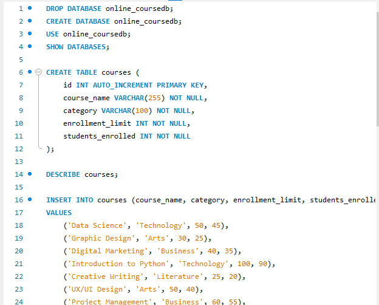

## Final Term Lab Task 3.1 - Using SELECT CLAUSE

# Task 1
Create a database named online_courseDB 
A table named courses with the following fields: 
id: Unique integer, auto-increment, primary key. 
course_name: String (VARCHAR), not null. 
category: String (VARCHAR), not null. 
enrollment_limit: Integer, not null. 
students_enrolled: Integer, not null. 

> 
> [Sample Output](image/courses%20-%20Copy.png)

