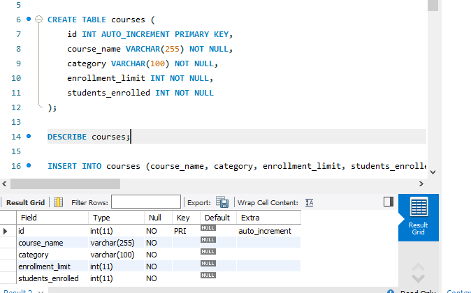
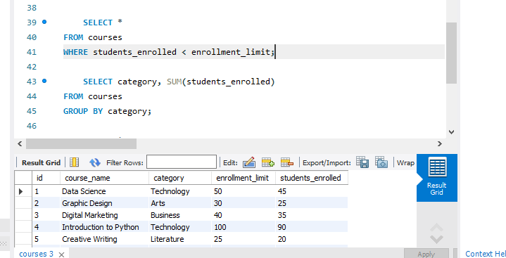
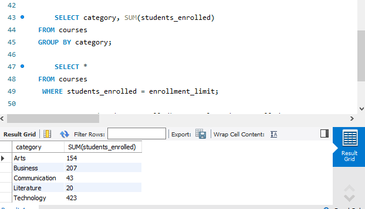
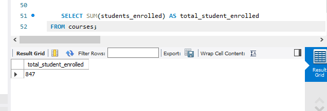
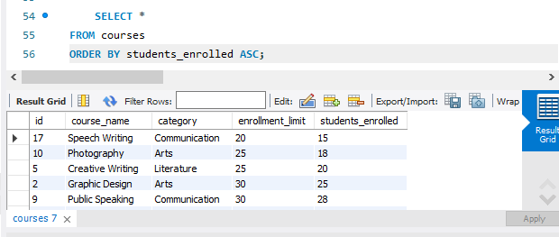

## Final Term Lab Task 3.1 - Using SELECT CLAUSE

# Create Table
Create a database named online_courseDB 
A table named courses with the following fields: 
id: Unique integer, auto-increment, primary key. 
course_name: String (VARCHAR), not null. 
category: String (VARCHAR), not null. 
enrollment_limit: Integer, not null. 
students_enrolled: Integer, not null. 

> 

>  

# Task 1
Retrieve all courses where students_enrolled is less than the enrollment_limit

>  

# Task 2
Group courses by category and calculate the total number of students enrolled for each category. 

>  

# Task 3
Retrieve the courses that are fully enrolled (i.e., students_enrolled equals enrollment_limit). 

>  

# Task 4
Calculate the total number of students enrolled across all courses

>  

# Task 5
Sort courses by students_enrolled in ascending order

>  

# Final Output Code

>  

