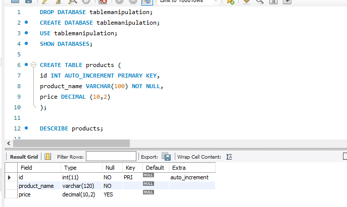
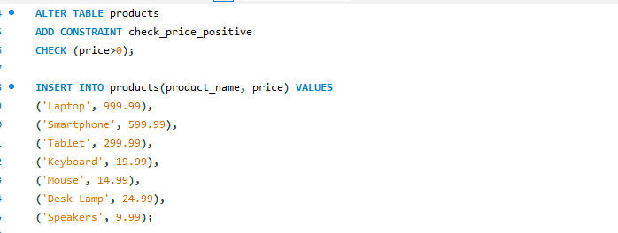
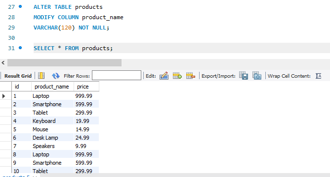
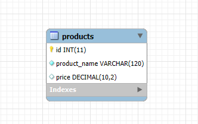

## Final Term Lab Task 3 - Table Manipulation
The following are the tasks that need to be implemented using MySQL statements. Make sure to complete them in the order specified

# *Task 1*
* <ins>Create a table named products with the following fields:
> id: Unique integer, auto-increment, primary key.\
product_name: String (VARCHAR) with a maximum length of 100, cannot be null.\
price: Decimal

> 

# *Task 2*
* <ins>Add a CHECK constraint to ensure that the price of the product must be greater
than 0.
> )

# *Task 3*
* <ins>Insert the products that will not violate the check constraint into the products
table
```
Product 1: "Laptop", 999.99
Product 2: "Headphones", -49.99
Product 3: "Smartphone", 599.99
Product 4: "Tablet", 299.99
Product 5: "Monitor", -149.99
Product 6: "Keyboard", 19.99
Product 7: "Mouse", 14.99
Product 8: "Desk Lamp", 24.99
Product 9: "External Hard Drive", -79.99
Product 10: "Speakers", 9.99
```
>

# *Task 4*
* <ins>Modify the product_name field to have a maximum length of 120 characters
> 

## **EER**

