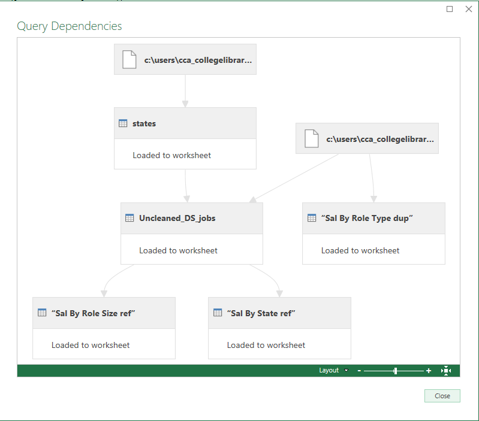

# Midterm Lab Task 2 - Data Cleaning and Preparation using POWER QUERY
Company X would like to extract some useful information from the Uncleaned_DS_jobs.csv taken from a Job Posting site available in Kaggle.
There are a lot of columns available but focus only on generating insights that will answer the ff: questions:
1. Which Job Roles pay the highest and least
2. What size companies pay the best
3. Where Job Roles or Job Titles pay the best and least in a specific state

## Data Cleaning Process
* Salary Estimate Column then Remove all the characters after the (open parentheses)
* Created 2 New Columns for Min Sal and Max Sal
* Add Column for Role Type
* Split Location column (Location 1 & Location 2/State Abbreviation)
* Filter Location Correction 2 to check outliers (Anne Rundell)
* Replace Values: Find Anne Rundell and replace with “NA”
* Created 2 New Columns (from the site): MinCompanySize and MaxCompanySize
* Competitors column: filter all “-1”s
* Revenue column: filter all “-1”s
* Industry column: filter all “-1”s
* Clean Company name and remove Ratings after the name of company
* Remove the Column “Job Descriptions”

## Reshape and Group the tables:
* Create a duplicate of the raw data Uncleaned_DS_jobs
* Rename the duplicate with “Sal By Role Type dup”
* Create a reference of the raw data Uncleaned_DS_jobs
* Rename the reference with “Sal By Role Size ref”
* Create a reference of the raw data Uncleaned_DS_jobs
* Rename the reference with “Sal By State ref”
* Mapping Other Files and include in the current queries

## A: Uncleaned_DS_jobs duplicate
* Click Choose Columns
* Select Role Type, Min Sal and Max Sal
* Change Data Type of min and max sal to currency
* Then multiply Min and Max Sal columns by 1000 (by going to Numbers Column – Click Standard → Multiply – Type 1000)
* Then Group the rows by role type and get the min sal and max sal average
* Select the role type column > click Group By under Transform Menu
* Then Group the rows by role type and get the average

## B: Uncleaned_DS_jobs reference
* Click Choose Columns
* Select Size: Min Sal and Max Sal
* Change Data Type of min and max sal to currency, then multiply by 1000
* Then Group the rows by size and get the min sal and max sal average
* Select the size column > click Group By under Transform Menu

## C: Uncleaned_DS_jobs reference
* Click Choose Columns
* Select State Full Name, Min Sal and Max Sal
* Change Data Type of min and max sal to currency then multiply by 1000
* Then Group the rows by State FullName and get the min sal and max sal average
* Select the size column > click Group By under Transform Menu

## D: Mapping Other Files and include in the current queries
* Click Unclean DS Jobs
* Click on any white space in the Queries pane → Right Click → New Query → Open the Workbook State Mapping → Select the columns → Click OK
* It should be now included in the queries
* Select Uncleaned DS Jobs from the queries
* Select state abbreviation (on both queries)
* Select Merge (as shown)
* Tap OK
* It should now match the State Abbreviation with the merged state
* Rename Columns as State Full Name
* Filter state Abbreviations and remove nulls and blanks

## Here's the screenshot of my output before I started data cleaning

## Here's the screenshot of my output after I started data cleaning

## Dependencies and References of the QUERIES

## Final Queries






